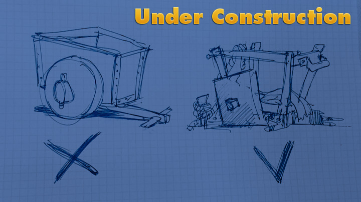

Welcome to the VaOcean source code!
===================================

VaOcean is the ocean surface simulation plugin for [Unreal Engine 4](https://www.unrealengine.com/).

The plugin includes:

* Component that renders displacement and gradient (normal) maps in real time
* Sample content, including water shader and grid meshes to be used on scene
* Set of global shaders that perform FFT calculation and other tech stuff on GPU

Check the **[Wiki](https://github.com/ufna/VaOcean/wiki)** tab to know more about the plugin.

Current version: **0.4 Alpha 6 Hotfix 1**

Legal info
----------

Unreal® is a trademark or registered trademark of Epic Games, Inc. in the United States of America and elsewhere. Unreal® Engine, Copyright 1998 – 2014, Epic Games, Inc. All rights reserved.

Plugin is completely **free** and available under [MIT open-source license](LICENSE).

References
----------

1. Tessendorf, Jerry. Simulating Ocean Water. In SIGGRAPH 2002 Course Notes #9 (Simulating Nature: Realistic and Interactive Techniques), ACM Press.

1. Phillips, O.M. 1957. On the generation of waves by turbulent wind. Journal of Fluid Mechanics. 2 (5): 417–445.

